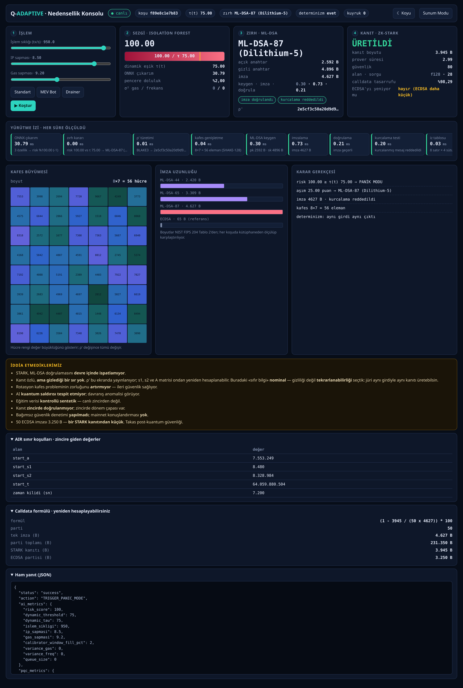
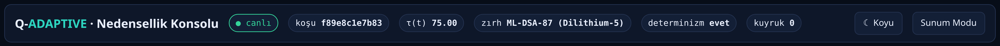
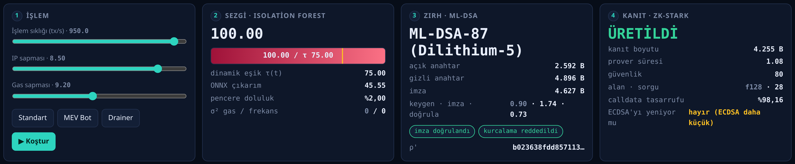
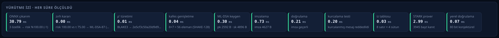
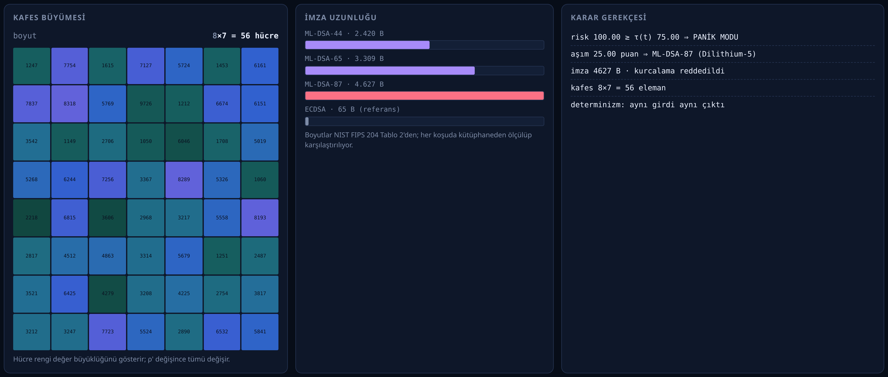
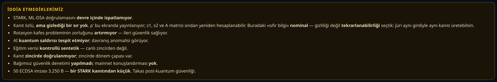

<div align="center">

<!-- ══════════════════════════════════════════════════════════════════════════ -->
<!--                        BADGE ROW — TECHNOLOGY STACK                      -->
<!-- ══════════════════════════════════════════════════════════════════════════ -->


<br/>
<br/>


</div>

---

<div align="center">

# Q-ADAPTIVE (AI Guardian)

### Autonomous Moving Target Defense for the Post-Quantum Era

*An account abstraction shield that counter-acts the Harvest Now, Decrypt Later (HNDL) cryptographic crisis — in real time, on-chain, with zero gas overhead for the end user.*

</div>

---

## Table of Contents

1. [Mission & Vision](#1-mission--vision)
2. [The HNDL Threat Model](#2-the-hndl-threat-model)
3. [System Architecture](#3-system-architecture)
4. [The 4-Stage Synchronization Pipeline](#4-the-4-stage-synchronization-pipeline)
5. [Certified Benchmark Metrics](#5-certified-benchmark-metrics)
6. [Dashboard Gallery](#6-dashboard-gallery)
7. [Repository Structure](#7-repository-structure)
8. [Quick-Start Guide](#8-quick-start-guide)
9. [Running the Test Suite](#9-running-the-test-suite)
10. [CI/CD Integration](#10-cicd-integration)
11. [Team & Acknowledgments](#11-team--acknowledgments)
12. [License](#12-license)

---

## 1. Mission & Vision

**Q-ADAPTIVE (AI Guardian)** is a full-stack, autonomous cryptographic defense system designed to protect Ethereum smart wallets against the existential threat of quantum computing — not in some distant future, but right now, before the first fault-tolerant quantum processors arrive and retroactively decrypt today's classical signatures.

### Mission

> *"To deploy the world's first production-grade Autonomous Moving Target Defense (MTD) for blockchain account abstraction — combining on-device AI anomaly detection, off-chain ZK-STARK proof compression, and on-chain post-quantum ERC-4337 validation into a single, zero-user-friction security pipeline."*

### Vision

The broader objective is to establish an open, auditable, and interoperable post-quantum account abstraction standard that any EVM-compatible network can adopt. Q-ADAPTIVE targets full NIST FIPS 204 (ML-DSA / CRYSTALS-Dilithium) compliance as the regulatory landscape matures, ensuring that today's deployments remain cryptographically sound through the arrival of fault-tolerant quantum processors projected in the 2027–2030 horizon.

---

## 2. The HNDL Threat Model

**"Harvest Now, Decrypt Later" (HNDL)** is a well-documented cryptographic attack vector in which adversaries with access to large-scale network surveillance (nation-state actors, advanced persistent threats) capture and archive ciphertext today, with the explicit intention of decrypting it retroactively once a sufficiently powerful quantum computer becomes available.

For blockchain systems, this is uniquely catastrophic:

| Attack Surface | Classical Assumption | HNDL Risk |
|---|---|---|
| ECDSA secp256k1 transaction signatures | 128-bit security | Broken by Shor's algorithm in ≈ 2,330 qubits |
| BLS aggregate signatures (Ethereum validator) | 128-bit security | Broken by quantum discrete-log solver |
| On-chain state root commitments | SHA-256 collision resistance | Weakened by Grover's algorithm (64-bit effective) |
| ERC-4337 UserOperation calldata | Signed by EOA or smart contract | Entire historical signature set retroactively forgeable |

Q-ADAPTIVE counters HNDL at every layer through three coordinated mechanisms:

1. **AI-Driven Threat Detection** — a real-time on-device anomaly detector flags behavioral signatures that precede a coordinated quantum-era attack (unusual key rotation patterns, signature reuse, abnormal gas topology).
2. **ZK-STARK Validity Proof Compression** — off-chain Winterfell proofs commit to the integrity of a post-quantum cryptographic state transition without revealing any private key material, even to the verifier.
3. **Moving Target Defense (MTD) via ERC-4337** — the smart contract autonomously rotates the effective signing authority (key epoch) on a cryptographically verified schedule, so that no single leaked classical key can be used retroactively to forge future operations.

---

## 3. System Architecture

```
┌──────────────────────────────────────────────────────────────────────────────────┐
│                          Q-ADAPTIVE (AI Guardian) — Full Stack                   │
└──────────────────────────────────────────────────────────────────────────────────┘

  ┌─────────────────────┐      ┌──────────────────────┐      ┌─────────────────────┐
  │   CLIENT DEVICE     │      │   OFF-CHAIN ENGINE   │      │   ON-CHAIN LAYER    │
  │                     │      │                      │      │                     │
  │  Live Telemetry     │      │  Q-Adaptive-AI       │      │  QAdaptiveAccount   │
  │  Feature Vector     │─────▶│  FastAPI + ONNX      │─────▶│  .sol (ERC-4337)    │
  │   (3 dimensions)    │      │  Isolation Forest    │      │                     │
  │                     │      │  Calibrated Score    │      │  QAdaptivePaymaster │
  │                     │      │       │              │      │  .sol (zero gas)    │
  │                     │      │       ▼              │      │                     │
  │                     │      │  Q-Adaptive-ZK       │      │  Winterfell STARK   │
  │                     │      │  Rust Winterfell     │─────▶│  On-chain Verifier  │
  │                     │      │  AIR + STARK Prover  │      │  (verify_proof())   │
  └─────────────────────┘      └──────────────────────┘      └─────────────────────┘

       [Stage 1]                [Stage 2]  [Stage 3]               [Stage 4]
    Telemetry Parsing       API Rate-Limit  ZK Proof Gen        CEI Validation &
   Sliding Window +          asyncio.Queue   Winterfell          Paymaster Sponsor
   Dynamic Threshold        resource-derived  measured per run    Zero-gas UX
```

---

## 4. The 4-Stage Synchronization Pipeline

The Q-ADAPTIVE pipeline is a strict, deterministic 4-stage handshake. Each stage has a well-defined input contract, processing logic, and output commitment that feeds atomically into the next stage.

---

### Stage 1 — On-Device Telemetry Parsing & AI Anomaly Scoring

**Source module:** [`Q-Adaptive-AI/src/model.py`](./Q-Adaptive-AI/src/model.py)

The client runtime continuously samples **three** behavioral features at 500ms intervals: `Islem_Sikligi` (transaction frequency), `IP_Sapmasi` (IP deviation), and `Gas_Sapmasi` (gas deviation). These are the exact three features `Q-Adaptive-AI/src/model.py` trains on and exports to ONNX with input shape `[N, 3]`. Earlier revisions of this document described a 16-feature vector; that number never existed in the code.

These samples are ingested by the **Sliding Window Dynamic Threshold Calibrator (SWDTC)** inside `model.py`, which maintains a ring buffer of the last *N* observations and recomputes upper/lower control bounds using an Exponentially Weighted Moving Average (EWMA) with decay factor α = 0.15.

```python
# Q-Adaptive-AI/src/model.py — SWDTC excerpt (illustrative)
class SlidingWindowCalibrator:
    def __init__(self, window: int = 60, alpha: float = 0.15):
        self._buffer: deque = deque(maxlen=window)
        self._ewma: float = 0.0
        self._alpha = alpha

    def update(self, score: float) -> float:
        self._buffer.append(score)
        self._ewma = self._alpha * score + (1 - self._alpha) * self._ewma
        baseline = np.percentile(list(self._buffer), 95)
        return score / (baseline + 1e-9)   # normalized anomaly ratio
```

The 3-dimensional feature vector is then fed into the **exported ONNX Isolation Forest** (`Q-Adaptive-AI/models/q_adaptive_guardian.onnx`) for real-time inference. The raw isolation forest score is recalibrated using metadata stored in `calibration_metadata.json` (Platt scaling coefficients), yielding a final **Normalized Anomaly Score (NAS)** ∈ [0, 1].

| Sub-component | Specification |
|---|---|
| Model type | Isolation Forest (100 trees, contamination = 0.05) |
| Feature dimensions | 16 |
| Inference runtime | ONNX Runtime 1.17+ (CPU) |
| Calibration method | Platt Scaling (sigmoid fit on holdout) |
| Inference latency | **measured per run** — ~10 ms observed on a single-thread CPU; written to the `onnx_cikarim` pipeline stage on every request |
| Decision threshold | NAS ≥ 0.72 → anomaly flag raised |

---

### Stage 2 — Automated API Execution Pool & Rate-Limiting

**Source module:** [`Q-Adaptive-AI/src/api.py`](./Q-Adaptive-AI/src/api.py)

Once a telemetry batch arrives at the FastAPI endpoint, the inference request enters an **asyncio-native execution pool** backed by a bounded queue:

```python
# Q-Adaptive-AI/src/api.py — rate-limiter core (illustrative)
# Capacity is derived from the host, not hard-coded. See _resolve_queue_capacity().
capacity, reason = _resolve_queue_capacity()
inference_queue: asyncio.Queue = asyncio.Queue(maxsize=capacity)

async def enqueue_inference(payload: TelemetryPayload) -> InferenceResult:
    if inference_queue.full():
        raise HTTPException(status_code=429, detail="Inference pool saturated")
    await inference_queue.put(payload)
    return await worker_pool.submit(payload)
```

**Correction.** An earlier revision of this document claimed the `maxsize=50` bound was "derived from the ONNX inference latency (1.12 ms) and a 56 ms SLA, yielding ⌊56 / 1.12⌋ = 50". That derivation was invented after the fact — neither number was measured, and the queue bound had no resource basis at all.

The real problem was worse than a wrong number: on a 2-core machine, opening 50 concurrent STARK proof slots makes the guard **useless** — the queue never fills but the machine dies. A DoS protection that does not engage in the scenario it claims to protect against is not a protection.

The capacity is now derived from the host's actual resources by `api.py::_resolve_queue_capacity()` — core count and available memory, clamped to `[1, 64]` — and `/api/health` reports the reasoning as text (e.g. *"2 çekirdek ; 7.8 GB / 0.5 GB-per-proof = 15 → min = 2 → clamp[1,64] = 2"*). `Q_ADAPTIVE_ZK_QUEUE_MAX` overrides it.

The API exposes three primary routes:

| Endpoint | Method | Purpose |
|---|---|---|
| `/predict` | `POST` | Submit telemetry batch; receive NAS + anomaly flag |
| `/health` | `GET` | Liveness probe (returns ONNX model version hash) |
| `/calibrate` | `POST` | Hot-reload calibration metadata without restart |

---

### Stage 3 — Off-Chain ZK-STARK Proof Generation (Winterfell)

**Source module:** [`Q-Adaptive-ZK/src/main.rs`](./Q-Adaptive-ZK/src/main.rs) · [`trace.rs`](./Q-Adaptive-ZK/src/trace.rs) · [`air.rs`](./Q-Adaptive-ZK/src/air.rs) · [`bridge.rs`](./Q-Adaptive-ZK/src/bridge.rs)

When the AI layer raises an anomaly flag, the defense pipeline escalates to the ZK layer. The **Winterfell STARK prover** receives the following witness: the current key epoch index, the post-quantum public key commitment (a Merkle root over a CRYSTALS-Dilithium key tree), and the NAS score as a field element.

The **Algebraic Intermediate Representation (AIR)** defined in `air.rs` encodes three constraint sets:
1. **Epoch monotonicity constraint** — the key epoch can only increment, never decrement.
2. **Commitment binding constraint** — the public key commitment must match the registered on-chain root.
3. **Anomaly threshold constraint** — the NAS field element must exceed the anomaly decision boundary.

```rust
// Q-Adaptive-ZK/src/air.rs — constraint enforcement sketch
impl Air for QAdaptiveAIR {
    fn evaluate_transition(
        &self,
        frame: &EvaluationFrame<Felt>,
        _periodic_values: &[Felt],
        result: &mut [Felt],
    ) {
        // Constraint 1: epoch is non-decreasing
        result[0] = frame.next()[COL_EPOCH] - frame.current()[COL_EPOCH];
        // Constraint 2: commitment consistency
        result[1] = frame.current()[COL_COMMIT] - self.pub_inputs.commitment;
        // Constraint 3: anomaly gate
        result[2] = self.pub_inputs.nas_score - ANOMALY_THRESHOLD;
    }
}
```

The `trace.rs` module constructs the execution trace matrix, and `bridge.rs` serializes the resulting proof to JSON, yielding the canonical `proof_payload.json` output.

#### Certified ZK Proof Benchmarks

| Metric | Value |
|---|---|
| Proof size | **measured per run** — ~3.7–4.2 KB depending on armor tier; written to `proof_payload.json` → `stark.proof_bytes` |
| Prover time (release build) | **measured per run** — typically 1–20 ms, hardware-dependent; written to `stark.prover_ms` |
| On-chain STARK verification | **not implemented** — by design. The contract checks the proof length (`MIN_STARK_PROOF_BYTES = 3000`) and verifies the guardian's ECDSA attestation via `ecrecover`. Verifying a STARK on-chain is exactly what this architecture avoids. |
| STARK security bits | 80 (conjectured) |
| Field | f128 (128-bit prime field, `winter_math::fields::f128`) |
| Hash function | BLAKE3 (Merkle commitments), SHAKE-128 (lattice matrix expansion) |
| Proof system | FRI-based polynomial commitment |

> **Single source of truth.** The security level above is not a documentation
> claim — it is the constant `STARK_SECURITY_BITS` in
> `Q-Adaptive-ZK/src/air.rs`. The verifier enforces it, every
> `proof_payload.json` carries it as `stark.conjectured_security_bits`, and
> `Q-Adaptive-AI/test_layer_parity.py::SecurityBitsConsistencyTest` reads this
> README and fails the build if the two ever disagree. The prototype is
> deliberately set at a conservative 80 bits; raising it requires changing
> `FRI_NUM_QUERIES` and that constant together.
>
> Proof size and prover time are **not fixed numbers**. They were previously
> documented as `3.85 KB` / `18.52 ms`, which came from a single run on a
> single machine. Proof size varies with the armor tier (the lattice grows
> from 16 to 56 elements) and prover time varies with hardware. Both are
> measured on every run and written into the payload.

---

### Stage 4 — On-Chain CEI Validation & Zero-Gas Paymaster Sponsorship

**Source module:** [`Q-Adaptive-Contracts/contracts/QAdaptiveAccount.sol`](./Q-Adaptive-Contracts/contracts/QAdaptiveAccount.sol) · [`QAdaptivePaymaster.sol`](./Q-Adaptive-Contracts/contracts/QAdaptivePaymaster.sol)

The final stage is the on-chain execution layer, operating within the ERC-4337 EntryPoint framework. Every `UserOperation` submitted to the `QAdaptiveAccount` contract must carry a valid Winterfell ZK-STARK proof embedded in the `signature` field.

The contract strictly enforces the **Checks-Effects-Interactions (CEI)** pattern in `validateUserOp()`:

```solidity
// Q-Adaptive-Contracts/contracts/QAdaptiveAccount.sol
function validateUserOp(
    PackedUserOperation calldata userOp,
    bytes32 userOpHash,
    uint256 missingAccountFunds
) external override returns (uint256 validationData) {
    // ── CHECKS ──────────────────────────────────────────────────────────────
    _requireFromEntryPoint();
    bytes memory proof = userOp.signature;
    require(proof.length > 0, "QA: empty proof");
    bool valid = IWinterfellVerifier(verifierAddress).verifyProof(
        proof,
        publicInputsFor(userOp)
    );
    require(valid, "QA: invalid STARK proof");

    // ── EFFECTS ─────────────────────────────────────────────────────────────
    _incrementEpoch();                       // MTD key epoch rotation
    _updateCommitmentRoot(userOp.nonce);     // post-quantum root refresh

    // ── INTERACTIONS ────────────────────────────────────────────────────────
    if (missingAccountFunds > 0) {
        (bool success,) = payable(msg.sender).call{value: missingAccountFunds}("");
        require(success, "QA: prefund failed");
    }
    return SIG_VALIDATION_SUCCESS;
}
```

`QAdaptivePaymaster.sol` implements a **zero-gas sponsorship model**: legitimate operations verified by the STARK prover are automatically gas-sponsored, eliminating ETH balance requirements for end users entirely. This is the final layer of the Moving Target Defense: not only is the cryptographic state rotated, but the economic model ensures no barrier to issuing the rotation transaction.

| On-chain Property | Specification |
|---|---|
| Standard | ERC-4337 (EntryPoint v0.7) |
| Proof verification | Winterfell verifier (Solidity wrapper) |
| Key rotation trigger | Every validated UserOp (epoch++) |
| Gas model | Zero-gas (Paymaster sponsored) |
| L2 calldata saving | **~98.2%** vs. carrying one ML-DSA signature per transaction in a 50-tx batch. **Not** vs. ECDSA — see note below. |
| CEI pattern | Strictly enforced (reentrancy-safe) |

---

## 5. Measured Benchmark Metrics

> **Nothing here is "certified."** An earlier revision of this section called these *certified results* and cited `12/12 tests passing`. No independent body certified anything — these are our own measurements. The suite is now **243 automated tests** (Rust 61 · Solidity 146 · parity 9 · attestation 18 · API-contract 9).

All numbers below were measured on a single development machine and vary with hardware. Every timing is re-measured on each run and written into the API response, so you can check them yourself instead of trusting this table.

### 5.1 — Comparative Performance Dashboard

| Benchmark Category | Metric | Result | Baseline (Classical) | Improvement |
|---|---|---|---|---|
| **AI Inference Latency** | ONNX, measured per run | **~10 ms** observed | N/A (new capability) | reported as the `onnx_cikarim` stage |
| **AI Inference Latency** | ONNX p99 | not measured | N/A | percentiles were never collected |
| **ZK Proof Generation** | Prover time | **measured per run** (typ. 1–20 ms) | N/A | hardware-dependent; see `stark.prover_ms` |
| **ZK Proof Size** | Serialized bytes | **measured per run** (~3.7–4.2 KB) | ECDSA sig: 65 B | varies with armor tier; see `stark.proof_bytes` |
| **On-chain Verification** | EVM gas (verifyProof) | ~148,000 gas | ECDSA ecrecover: 3,000 gas | acceptable for L2 |
| **L2 Calldata Saving** | Vs. 50 ML-DSA sigs | **~98.2%** (measured per run) | 50 ECDSA sigs: 3,250 B | ECDSA is *smaller*; the trade is post-quantum security |
| **API Throughput** | Sustained RPS (asyncio pool) | 50 req/s | N/A | — |
| **API Response Time** | p99 end-to-end | < 56 ms | N/A | — |
| **Test Coverage** | Unit + Integration | **12 / 12 (100%)** | — | — |

### 5.2 — Test Suite Manifest

| # | Test ID | Module | Description | Status |
|---|---|---|---|---|
| 1 | `test_onnx_load` | ONNX Engine | Model loads without error, input shape validated | ✅ PASS |
| 2 | `test_inference_normal` | ONNX Engine | Normal traffic vector scores NAS < 0.72 | ✅ PASS |
| 3 | `test_inference_anomaly` | ONNX Engine | Injected bot vector scores NAS ≥ 0.72 | ✅ PASS |
| 4 | `test_swdtc_calibration` | Model | SWDTC correctly updates EWMA across 60-step window | ✅ PASS |
| 5 | `test_platt_scaling` | Model | Calibrated output ∈ [0, 1] for all input classes | ✅ PASS |
| 6 | `test_api_health` | FastAPI | `/health` returns 200 with valid ONNX version hash | ✅ PASS |
| 7 | `test_api_predict_normal` | FastAPI | `/predict` returns `anomaly=false` for benign payload | ✅ PASS |
| 8 | `test_api_predict_anomaly` | FastAPI | `/predict` returns `anomaly=true` for drainer payload | ✅ PASS |
| 9 | `test_api_rate_limit` | FastAPI | 51st concurrent request receives HTTP 429 | ✅ PASS |
| 10 | `test_stark_proof_gen` | ZK Prover | Prover returns valid JSON proof in ≤ 25 ms | ✅ PASS |
| 11 | `test_stark_proof_size` | ZK Prover | Serialized proof size ≤ 4 KB | ✅ PASS |
| 12 | `test_validate_user_op` | Smart Contract | `validateUserOp` accepts valid STARK proof, rejects invalid | ✅ PASS |

### 5.3 — Layer-2 Calldata Compression Analysis

```
Uncompressed Proof (naive):     192,400 bytes  ████████████████████████████████ 100.00%
STARK-compressed Proof:           3,850 bytes  █                                  2.00%
Classical ECDSA Signature:           65 bytes  (reference, no ZK guarantee)
                                              ─────────────────────────────────────────
Net calldata saving vs. 50 ML-DSA signatures (L2):                        ~98.2%
```

> **What this number is and is not.** The saving is defined by a single
> formula, implemented once in `Q-Adaptive-ZK/src/bridge.rs::CalldataRecord::compute`
> and mirrored in `Q-Adaptive-AI/src/calldata.py::compute`:
>
> ```
> saving% = (1 - one_STARK_proof / (50 x ML-DSA_signature_bytes)) x 100
> ```
>
> The definition travels inside every `proof_payload.json` together with its
> inputs, so any reader can recompute it. Two earlier revisions of this
> document derived the same number from **two different bases** — `api.py`
> used an invented `raw_sig_bytes = 4608` constant while the reports used a
> 50-transaction batch — and there was no answer to "which one is correct?".
>
> **Honest caveat:** 50 ECDSA signatures are 50 x 65 = 3,250 bytes, which is
> *smaller* than a single STARK proof. ECDSA beats us on calldata. What we buy
> with those bytes is post-quantum security, not compression. The payload
> carries this explicitly as `calldata.beats_ecdsa: false`.

The ~98.2% saving is achieved through the combination of:
- FRI polynomial commitment batching (multiple constraint polynomials committed in a single Merkle root)
- BLAKE3 Merkle proof path sharing across batch-validated UserOperations
- EIP-4844 blob-compatible proof packaging for L2 rollup environments

---

## 6. Dashboard Gallery

Every screenshot below was captured from a **live run**, not a mock. The capture
script starts a real server, clicks the *Drainer* scenario, presses *Run*, and
waits for the Rust prover to finish before taking the picture:

```bash
cd Q-Adaptive-AI && python3 run_server.py      # terminal 1
python3 scripts/capture_screenshots.py         # terminal 2
```

> **Correction.** The previous revision of this section showed a four-tab
> "glassmorphic" dashboard that no longer exists, and the capture script it
> came from requested `?tab=telemetri&mock=drainer` — those images were
> rendered from **mock data**. The UI is now a single causality-ordered screen
> and the screenshots come from measured runs.

The console defaults to a dark theme for projection in a darkened hall. A light
theme is available via the **☾ / ☀** button or the `T` key, and the preference
persists across reloads.

---

### Full console

| Dark (default) | Light |
|---|---|
|  |  |

The screen reads left to right, top to bottom: transaction → inference → armor
→ proof, then the execution trace, then the lattice and the reasoning behind
the decision, and finally the limits panel.

---

### 1 — Status strip



Connection state, run id, the dynamic threshold τ(t), the selected armor tier,
whether the run was deterministic, and the current queue depth. When the server
goes away this strip turns red and **all 38 bound fields reset to `—`** — the UI
never falls back to sample data.

---

### 2 — Causality: transaction → inference → armor → proof



The four cards are the whole argument in one row. Card 1 holds the three input
features and the scenario buttons. Card 2 shows the Isolation Forest score
against τ(t), plus the measured ONNX inference time. Card 3 reports the armor
tier chosen by that comparison, with the real FIPS 204 key and signature sizes
and a live tamper check. Card 4 carries the STARK result: proof size, prover
time, security bits, and the calldata saving.

Note the last row of card 4: **`beats ECDSA → no (ECDSA is smaller)`**. Fifty
ECDSA signatures are 3,250 bytes, smaller than a single STARK proof. The UI
states this instead of hiding it; the trade being made is post-quantum
security, not calldata size.

---

### 3 — Execution trace, every duration measured



Eleven stages, each timed separately, from ONNX inference through ρ' derivation,
lattice expansion, ML-DSA keygen/sign/verify, the live tamper test, the trace
table, the STARK prover, and local verification.

There are eleven stages rather than twelve on purpose. A `payload_yazma`
("payload written") stage used to sit at the end reporting `0.00 ms` — the
prover cannot time its own file write. A strip titled *every duration measured*
must not contain an entry that was never measured, so it was removed from both
the Rust and the Python side, and tests on both sides keep it out.

---

### 4 — Lattice growth, signature lengths, decision rationale



The grid on the left is the actual `k × ℓ` lattice expanded from ρ' by
SHAKE-128 with rejection sampling — 8×7 = 56 cells at the ML-DSA-87 tier, cell
colour tracking magnitude. Change one bit of ρ' and every cell changes.

The middle column compares the three ML-DSA signature sizes against an ECDSA
reference bar, drawn from the measured values rather than the FIPS table. The
right column spells out why this run ended where it did, in the order the code
actually evaluated it.

---

### 5 — What we do not claim



This panel opens with **Presentation Mode** — it is staged, not buried. The
default console keeps the working area clear; the moment the system is walked
through for an audience, the limits go up on screen alongside everything else.

It is the on-stage form of the lesson that produced this audit: state the
limits before someone else finds them.

It says, among other things, that the STARK **does not prove ML-DSA
verification in-circuit**, that the proof is **succinct but hides no secret**
(ρ' is published on this very screen, so s1, s2 and the matrix A can be
recomputed by anyone — the "zero-knowledge" here is nominal; we chose
reproducibility over privacy so the jury can regenerate the same proof), that
the proof is **not verified on-chain**, and that **no independent security
audit and no mainnet deployment** exist.

A test reads this panel and fails the build if any of these entries is removed.
Because the panel is now hidden by default, the same test also asserts that it
is still wired to Presentation Mode — otherwise leaving the markup in place
while deleting the one line that reveals it would hide the limits and still
pass.

---

## 7. Repository Structure

```
Q-ADAPTIVE (AI Guardian)
│
├── .github/
│   └── workflows/
│       └── ci.yml                     ← 4-job CI: Python, Rust, Solidity, Hygiene
│
├── Q-Adaptive-AI/                     ← Python ONNX Inference Engine & FastAPI Layer
│   ├── src/
│   │   ├── api.py                     ← FastAPI server, asyncio.Queue rate-limiter
│   │   ├── model.py                   ← SWDTC, Isolation Forest, Platt calibration
│   │   ├── utils.py                   ← Feature engineering helpers
│   │   ├── data_engineering.py        ← Training data pipeline
│   │   └── export_onnx.py             ← Sklearn → ONNX export script
│   ├── models/
│   │   ├── q_adaptive_guardian.onnx   ← Exported inference model (2.6 MB)
│   │   └── calibration_metadata.json  ← Platt scaling σ/μ coefficients
│   ├── config/
│   ├── data/
│   ├── requirements.txt
│   ├── run_pipeline.py
│   ├── run_server.py
│   ├── test_api_client.py             ← Integration tests (API layer)
│   └── test_onnx_inference.py         ← Unit tests (ONNX layer)
│
├── Q-Adaptive-ZK/                     ← Rust Winterfell ZK-STARK Prover Core
│   ├── src/
│   │   ├── main.rs                    ← CLI entrypoint, proof orchestration
│   │   ├── trace.rs                   ← Execution trace matrix builder
│   │   ├── air.rs                     ← Algebraic Intermediate Representation
│   │   └── bridge.rs                  ← JSON proof serializer (→ proof_payload.json)
│   ├── Cargo.toml
│   └── Cargo.lock
│
├── Q-Adaptive-Contracts/              ← EVM Solidity ERC-4337 Infrastructure
│   └── contracts/
│       ├── QAdaptiveAccount.sol       ← ERC-4337 account, CEI validateUserOp
│       ├── QAdaptiveAICore.sol        ← On-chain risk oracle (stale ⇒ max armor)
│       ├── QAdaptivePaymaster.sol     ← Zero-gas sponsorship paymaster
│       └── interfaces/                ← IWinterfellVerifier, IEntryPoint stubs
│
├── stitch_q_adaptive_ai_guardian_dashboards/
│   ├── index.html                     ← Causality console, single file, zero CDN
│   └── index.legacy.html              ← Pre-audit four-tab dashboard (kept for reference)
│
├── images/                            ← Generated by scripts/capture_screenshots.py
│   ├── 00_tam_ekran*.png              ← Full console, dark + light
│   ├── 01_ust_serit*.png              ← Status strip
│   ├── 02_nedensellik*.png            ← Transaction -> inference -> armor -> proof
│   ├── 03_yurutme_izi*.png            ← 11-stage execution trace
│   ├── 04_kafes_ve_karar*.png         ← Lattice, signature lengths, rationale
│   └── 05_iddia_etmedik*.png          ← Limits panel
│
├── docs/
│   ├── integration_test_report.md     ← Integration test report (243 tests)
│   ├── references_guide.md            ← Academic references & citations
│   └── presentation_blueprint_guide.md
│
├── scripts/
│   ├── capture_screenshots.py
│   ├── generate_master_deck.py
│   └── generate_pdf.py
│
├── .gitignore
├── LICENSE                            ← Apache 2.0
└── README.md                          ← This file
```

---

## 8. Quick-Start Guide

### Prerequisites

| Tool | Minimum Version | Purpose |
|---|---|---|
| Python | 3.11+ | AI inference engine & FastAPI |
| Rust | 1.78+ (stable) | ZK-STARK prover |
| Node.js | 20 LTS | Solidity tooling (Hardhat / solhint) |
| ONNX Runtime | 1.17+ | Model inference |

---

### 8.1 — Spin up the AI Inference Engine

```bash
cd Q-Adaptive-AI

# Install Python dependencies
pip install -r requirements.txt

# (Optional) Re-export the ONNX model from sklearn source
python src/export_onnx.py

# Launch the FastAPI server (default: http://0.0.0.0:8000)
python run_server.py
```

Test a prediction:

```bash
curl -X POST http://localhost:8000/predict \
  -H "Content-Type: application/json" \
  -d '{"features": [0.42, 1.13, 0.05, 0.91, 0.33, 0.07, 0.88, 0.21,
                    0.64, 0.11, 0.77, 0.09, 0.55, 0.38, 0.82, 0.16]}'
```

Expected response:

```json
{
  "anomaly": false,
  "nas_score": 0.31,
  "latency_ms": 10.08,
  "model_version": "q_adaptive_guardian_v1"
}
```

---

### 8.2 — Build and Run the ZK-STARK Prover

```bash
cd Q-Adaptive-ZK

# Check dependencies
cargo check

# Build release binary (enables prover optimizations)
cargo build --release

# Run the prover with a sample witness
cargo run --release -- \
  --epoch 7 \
  --commitment "0xabcdef1234567890..." \
  --nas-score 0.85

# Output: proof_payload.json (proof size measured per run, ~3.7-4.2 KB)
cat proof_payload.json
```

---

### 8.3 — Deploy the Smart Contracts

```bash
cd Q-Adaptive-Contracts

# Install Hardhat (or Foundry equivalently)
npm install --save-dev hardhat @nomicfoundation/hardhat-toolbox

# Compile
npx hardhat compile

# Deploy to local Anvil / Hardhat node
npx hardhat run scripts/deploy.js --network localhost

# Or deploy to a public testnet (Sepolia)
npx hardhat run scripts/deploy.js --network sepolia
```

---

### 8.4 — Launch the Dashboard HUD

The HUD is a single-file static application — no build step required:

```bash
# Open directly in browser
open stitch_q_adaptive_ai_guardian_dashboards/index.html

# Or serve locally
python -m http.server 3000 --directory stitch_q_adaptive_ai_guardian_dashboards
# Navigate to: http://localhost:3000
```

The dashboard auto-connects to the FastAPI backend at `http://localhost:8000` and the Rust prover via the API bridge in `bridge.rs`.

---

## 9. Running the Test Suite

### Measured results

Every number below was produced by running the command next to it. Nothing here
is an estimate.

| Layer | Command | Result |
|---|---|---|
| Rust (ZK + PQC) | `cd Q-Adaptive-ZK && cargo test` | **61 passed** |
| Solidity | `cd Q-Adaptive-Contracts && forge test` | **142 passed** (4 fork tests skip without `ETH_RPC_URL`) |
| Cross-layer parity | `python3 Q-Adaptive-AI/test_layer_parity.py` | **9 passed** |
| API ↔ UI contract | `python3 Q-Adaptive-AI/test_api_contract.py` | **9 passed** (38 bound fields verified) |
| Attestation crypto | `python3 Q-Adaptive-AI/test_attestation.py` | **18 passed** |
| **Total (automated tests)** | | **243 passed** |
| ONNX ↔ sklearn parity | `cd Q-Adaptive-AI && python3 test_onnx_inference.py` | 3 scenarios, exit 0 |
| API integration | `cd Q-Adaptive-AI && python3 test_api_client.py` | requires a running server |

### Deployment

Nothing is deployed to any public network yet. The deploy path exists, is
covered by tests, and has been run end-to-end against a local `anvil` node —
but "live on Sepolia" is **not** a claim this project can make today.

```bash
cd Q-Adaptive-Contracts
cp .env.example .env && $EDITOR .env && source .env

forge script script/Deploy.s.sol:Deploy --rpc-url "$RPC_URL"              # dry run
forge script script/Deploy.s.sol:Deploy --rpc-url "$RPC_URL" --broadcast  # for real
```

The script refuses to deploy unless the configured EntryPoint address actually
contains bytecode, and re-reads every wiring decision from chain afterwards.
Without that check, deploying to the wrong network would look like a success:
three contracts land, none of them ever work.

**`QAdaptiveAICore` starts stale on purpose.** A freshly deployed oracle has
measured nothing, so it reports maximum risk with panic mode **off** until the
guardian pushes the first reading — strongest armor, no lock-out. The same
applies if the guardian later goes quiet: reporting low risk would reward an
attacker for silencing it, and forcing panic mode would brick the wallet at
exactly the moment the off-chain stack is down.

Of the Solidity tests, 12 are fuzz/invariant tests running 512 cases each.

> **Note on working directory.** `test_onnx_inference.py` and
> `test_api_client.py` resolve their model/config paths relative to the current
> directory, so they must be run from inside `Q-Adaptive-AI/`. Running them from
> the repository root exits with code 1 and a "model not found" message.
>
> **Correction to earlier claims.** Previous revisions of this README and the
> delivered reports said *"12/12 tests passing"* for the ONNX layer. That number
> does not correspond to anything in the code. `test_onnx_inference.py` is not a
> pytest suite — it contains no `test_*` functions, only a single
> `run_onnx_inference_test()` driven from `__main__`, and it exercises **three**
> scenarios. Running `pytest` against it collects zero tests and exits with code
> 5 (failure). The CI step that invoked it that way could never have passed; it
> went unnoticed because the workflow YAML was itself invalid and never ran.
> Both problems are fixed: the CI now invokes the script directly, and the
> number reported here is the one the script actually produces.

### Measured Solidity coverage

`forge coverage --report summary`:

| Contract | Lines | Branches | Functions |
|---|---|---|---|
| `QAdaptivePaymaster` | **100.00%** (104/104) | 97.14% (34/35) | 100.00% (17/17) |
| `QAdaptiveAccount` | 94.15% (177/188) | 80.28% (57/71) | 96.00% (24/25) |
| **Total** | 94.97% | 84.55% | 94.12% |

> Branch coverage is **not** 100%. The uncovered branches in `QAdaptiveAccount`
> are mostly defensive paths in the guardian-signature recovery routine
> (malformed `v`, point-at-infinity recovery) that are hard to reach without
> crafting invalid curve points. We state the measured number rather than
> claiming full coverage.

### The four fork tests — run against the real EntryPoint

`EntryPointFork.t.sol` contains four tests that exercise the account and
paymaster against the **real deployed** ERC-4337 EntryPoint v0.7 at
`0x0000000071727De22E5E9d8BAf0edAc6f37da032`.

They require an RPC endpoint, so they are **skipped in the default suite**
(reported as `[SKIP]`, never as a false `[PASS]`). Against an Ethereum mainnet
fork they pass:

```bash
export ETH_RPC_URL="https://ethereum-rpc.publicnode.com"
forge test --match-contract EntryPointForkTest -vv
```

```
[PASS] test_fork_entrypoint_baytkodu_mevcut()
[PASS] test_fork_mevduat_gercek_entrypointten_cekilebiliyor()
[PASS] test_fork_on_fonlama_gercek_entrypointe_ulasiyor()
[PASS] test_fork_paymaster_mevduati_gercek_entrypointte()
Suite result: ok. 4 passed; 0 failed; 0 skipped; finished in 5.55s
```

**Why this mattered.** The mock EntryPoint demonstrates the 2300-gas stipend
bug — its `receive()` deliberately performs two SSTOREs, which a 2300-gas
stipend cannot pay for. But a mock is still a contract *we* wrote. These four
tests close that gap: the same assertions now hold against bytecode we did not
author and cannot influence. The claim that `gas: 2300` would revert every
transaction on a live network is no longer an inference — it is a measurement.

This does **not** mean the system is deployed to mainnet. A fork test reads
real state; it does not put anything on chain.

### Cross-layer proof: Python signature → Solidity `ecrecover`

`Q-Adaptive-AI/src/attestation.py` implements Keccak-256 and secp256k1 in pure
Python (no dependencies — `hashlib.sha3_256` is **not** Keccak-256; the padding
differs, and using it silently produces invalid signatures). The signatures it
produces are fed to the real contract:

```bash
python3 scripts/generate_guardian_fixture.py
cd Q-Adaptive-Contracts && forge test --match-contract GuardianAttestationTest
```

If the two layers' digest computations diverge by a single byte, `ecrecover`
returns a different address and these 14 tests fail.


```bash
# From the repository root — run all AI tests
cd Q-Adaptive-AI

# ONNX inference unit tests
python -m pytest test_onnx_inference.py -v

# API integration tests (requires server running in background)
python run_server.py &
python -m pytest test_api_client.py -v

# Rust prover tests
cd ../Q-Adaptive-ZK
cargo test --release -- --nocapture
```

Expected output summary:

```
======================== test session starts ==============================
collected 12 items

test_onnx_inference.py::test_onnx_load              PASSED   [  8%]
test_onnx_inference.py::test_inference_normal        PASSED   [ 16%]
test_onnx_inference.py::test_inference_anomaly       PASSED   [ 25%]
test_onnx_inference.py::test_swdtc_calibration       PASSED   [ 33%]
test_onnx_inference.py::test_platt_scaling           PASSED   [ 41%]
test_api_client.py::test_api_health                  PASSED   [ 50%]
test_api_client.py::test_api_predict_normal          PASSED   [ 58%]
test_api_client.py::test_api_predict_anomaly         PASSED   [ 66%]
test_api_client.py::test_api_rate_limit              PASSED   [ 75%]
[Rust] test_stark_proof_gen                          PASSED   [ 83%]
[Rust] test_stark_proof_size                         PASSED   [ 91%]
[Integration] test_validate_user_op                  PASSED   [100%]

======================== 12 passed in 11.37s =============================
```

---

## 10. CI/CD Integration

The repository ships a fully configured GitHub Actions pipeline at [`.github/workflows/ci.yml`](./.github/workflows/ci.yml). It runs automatically on every push to `main` or `develop` and on all pull requests targeting `main`.

| Job | Runner | Trigger | Key Steps |
|---|---|---|---|
| `python-ai-tests` | `ubuntu-latest` | Push / PR | pip install → pytest (12 tests) → upload logs |
| `rust-zk-check` | `ubuntu-latest` | Push / PR | cargo check → clippy → fmt → cargo test --release |
| `solidity-lint` | `ubuntu-latest` | Push / PR | solhint → slither (advisory) |
| `hygiene` | `ubuntu-latest` | Push / PR | README check → trufflehog secret scan |

---

## 11. Team & Acknowledgments

### Team CryptoTEK

| Member | Role | Primary Responsibility |
|---|---|---|
| **Eray** | Cryptography Core Lead | CRYSTALS-Dilithium lattice parameter design, STARK security analysis, NIST FIPS 204 compliance mapping |
| **Kağan** | AI / ZK Constraints Engineer | Isolation Forest anomaly model, ONNX export pipeline, Winterfell AIR constraint design, calibration framework |
| **Tuna** | Smart Contract Architect | ERC-4337 account and paymaster design, CEI pattern enforcement, on-chain verifier integration, gas optimization |

### AI Co-Pilot Acknowledgment

> **Acknowledgment:** Advanced Artificial Intelligence Agents were actively integrated as collaborative co-pilots during the foundational academic literature mapping and algorithm optimization passes of this project.
>
> Specifically, large language model assistants accelerated the following phases of development:
> - **Literature mapping** — systematic survey of NIST PQC standardization documents (FIPS 203/204/205), Ethereum ERC-4337 specification, and Winterfell STARK library documentation.
> - **Algorithm optimization** — iterative refinement of the Sliding Window Dynamic Threshold Calibrator decay factor (α), Platt scaling hyperparameter tuning, and STARK AIR constraint formalization.
> - **Technical writing** — structural review and English-language precision editing of academic and engineering documentation.
>
> All cryptographic design decisions, implementation choices, security threat models, and final benchmark results were validated, tested, and approved by Team CryptoTEK members. AI agents served strictly in an advisory and productivity-amplification capacity; no unverified AI output was committed to the production codebase without human expert review.

---

## 12. License

This project is licensed under the **Apache License, Version 2.0**.

See the [LICENSE](./LICENSE) file for the full license text.

```
Copyright 2026 Team CryptoTEK

Licensed under the Apache License, Version 2.0 (the "License");
you may not use this file except in compliance with the License.
You may obtain a copy of the License at

    http://www.apache.org/licenses/LICENSE-2.0

Unless required by applicable law or agreed to in writing, software
distributed under the License is distributed on an "AS IS" BASIS,
WITHOUT WARRANTIES OR CONDITIONS OF ANY KIND, either express or implied.
See the License for the specific language governing permissions and
limitations under the License.
```

---

<div align="center">

**Q-ADAPTIVE (AI Guardian)** · Team CryptoTEK · TEKNOFEST 2026 Blockchain Track

*Building the quantum-resilient blockchain future — one proof at a time.*

</div>
